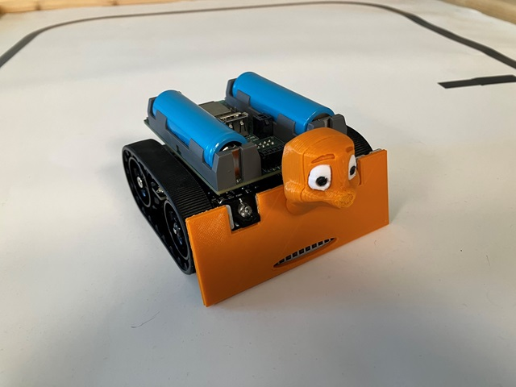

# ros2_dcs_turtlesim
This project is a ROS2 Package wrapper for the TurtleSim demo with
DroidControlShip and RadonUlzer robots under Webots.

These robot projects are build using PlatformIO. The ros2_dcs_turtlesim
package creates a ROS2 cmake wrapper around them and adds a launch
configuration for the turtle demo.

## Workspace Setup

### Checkout `ros2_dcs_turtlesim` into your ROS2 workspace

Go into the src folder of your ros2 workspace and checkout this
repository there:

        cd ros2_webots_ws/src
        git clone https://github.com/nhjschulz/ros2_dcs_turtlesim

### Checkout the dependend PlatformIO projects

Checkout the following PlatformIO projects to a fitting location.
This should not be inside your ROS workspace, as these are not ROS2 
packages:

* RadonUlzer: https://github.com/BlueAndi/RadonUlzer
* DroidControlShip: https://github.com/BlueAndi/DroidControlShip (Branch feature/ROS2)

    
        git clone https://github.com/BlueAndi/RadonUlzer
        git clone https://github.com/BlueAndi/DroidControlShip
        cd DroidControlShip
        git checkout feature/ROS2

Add the following environment variables which tell `ros2_dcs_turtlesim`
where the PlatformIO based projects are:

        $ export DCS_HOME=<checkout location of DroidControlShip>
        $ export RU_HOME=<checkout location of RadonUlzer>

## Building 

Go into your ROS2 workspace and use the normal ROS2 commands for building

        colcon build
        source install/local_setup.bash

The first build must be the complete workspace. Later it is possible to
build only this package (and in verbose mode) use:

        colcon build --event-handlers console_direct+ --cmake-args -DCMAKE_VERBOSE_MAKEFILE=ON  --packages-select ros2_dcs_turtlesim
        source install/local_setup.bash

## Launching

The `ros2_dcs_turtlesim` includes a launch configuration. Run it using

        ros2 launch ros2_dcs_turtlesim launch.py [world:=<path-to-world-file>] [launch_webots:=true|false]

Running with launch_webots:=false only runs the external controllers. This is usefull after a reload
of the world. Default is to launch webots as well.
The default world file is is set to worlds/minimal/DcsMinimal.wbt.